# ARCHITECTURE.md — System Architecture for DEEN-OPS Terminal

## 1. System Overview

**DEEN-OPS Terminal** is an enterprise operations workspace designed for high-throughput E-commerce operations in Bangladesh. It bridges:
1. **WooCommerce Storefront**: Synchronizing live orders, inventory quantities, and customer records.
2. **Pathao Logistics API**: Generating bulk courier consignments, tracking parcels, and auditing delivery health.
3. **Retail POS / SIP Stock Engine**: Reconciling physical outlet stocks with warehouse demand.
4. **Shift & Financial Analytics**: Real-time KPI aggregation, 30-day revenue trends, and shift handover reports.

---

## 2. Layered Architecture & Module Dependencies

```mermaid
graph TD
    App["app.py / src/app_bootstrap.py"] --> Pages["src/pages/"]
    
    subgraph Presentation
        Pages --> Dashboard["live_dashboard.py"]
        Pages --> PathaoOrders["pathao_orders/"]
        Pages --> DeliveryParser["delivery_parser.py"]
        Pages --> StockAnalytics["stock_analytics.py"]
        Pages --> ReturnAnalytics["return_analytics.py"]
        Pages --> WooOrders["woocommerce_orders.py"]
        Pages --> OutletMapper["sip_outlet_mapper.py"]
    end

    subgraph UI_Components ["src/components/"]
        Dashboard --> DashOutput["dashboard/dashboard_output.py"]
        Dashboard --> DashMetrics["dashboard/dashboard_metrics.py"]
        Dashboard --> DashCharts["dashboard/dashboard_charts.py"]
        Pages --> ModernKPI["react_kpi.py / modern_kpi.py"]
        Pages --> UIWidgets["ui/widgets.py"]
    end

    subgraph Data_Processing ["src/processing/"]
        Pages --> DataProc["data_processing.py"]
        Pages --> OrderProc["order_processor.py"]
        Pages --> SIPProc["sip_outlet_processor.py"]
        Pages --> Forecasting["forecasting.py"]
        Pages --> MarketBasket["market_basket.py"]
    end

    subgraph External_Services ["src/services/"]
        DataProc --> WooClient["woocommerce/client.py"]
        PathaoOrders --> PathaoClient["pathao/client.py"]
        Pages --> ExportService["exports/excel_exporter.py"]
    end

    subgraph Utilities_And_State ["src/utils/ & src/state/"]
        DataProc --> MetricHistory["metric_history.py"]
        DataProc --> CustRegistry["customer_registry.py"]
        Pages --> StatePersist["state/persistence.py"]
        External_Services --> SafeOps["safe_ops.py / logging.py"]
    end

    subgraph Core_Configuration ["src/config/"]
        MetricHistory --> Constants["constants.py"]
        Pages --> UIConfig["ui_config.py"]
        External_Services --> Settings["settings.py"]
    end
```

---

## 3. Core Data Pipelines

### A. WooCommerce Order Ingestion & Partitioning Pipeline
1. **Fetch & Cache**: [`src/services/woocommerce/client.py`](file:///h:/Repo/Order%20Process%20Automation/src/services/woocommerce/client.py) pulls orders via REST API with exponential backoff and stores raw payload in `st.session_state["wc_full_df"]`.
2. **Operational Partitioning**:
   - `_compute_cutoff_times(BD_TZ)` calculates operational shift windows (e.g. 18:00 to 18:00 next day).
   - **Today Partition (`wc_curr_df`)**: Non-cancelled workload within the current operational window + active processing orders.
   - **Prev Partition (`wc_prev_df`)**: Shipped orders modified within the prior operational window.
   - **Queue Partition (`wc_backlog_df`)**: Active unfulfilled orders (`on-hold`, `waiting`, `pending`) across all dates.
3. **Comparison Frame Engine**:
   - [`_get_comparison_frame()`](file:///h:/Repo/Order%20Process%20Automation/src/pages/live_dashboard.py) dynamically resolves previous working day orders for "Today Shipped", "All Orders", and "Last Day Shipped" views.

### B. Pathao Courier Logistics Pipeline
1. **Order Preparation**: Orders in `processing` or `shipped` status are validated for phone formatting (11-digit BD mobile), delivery zone mapping, and item description summary.
2. **Dispatch Ledger**: Tracks consignments in `resources/shipped_history.json` to prevent duplicate dispatches.
3. **Bulk API Execution**: Sends payload to Pathao Merchant API (`/aladdin/api/v1/orders/bulk`) and stores consignment IDs.

### C. SIP Stock & Smart Inventory POS Engine
1. **POS Ingestion**: Live POS stock exports or REST payloads are ingested via [`src/pages/stock_analytics.py`](file:///h:/Repo/Order%20Process%20Automation/src/pages/stock_analytics.py).
2. **Outlet Normalization**: Outlet names (e.g., Mirpur 12, Wari, Cumilla, Sylhet, Warehouse) are mapped and verified against SIP rules.
3. **Multi-Outlet Pivot Grid**: Aggregates stock counts per Product/Size/SKU across physical retail outlets vs. central warehouse.

### D. Metric Persistence & 30-Day Trend Chart
1. **Daily Snapshots**: Each shift render triggers [`save_shift_snapshot()`](file:///h:/Repo/Order%20Process%20Automation/src/utils/metric_history.py#L26), saving to `resources/metric_snapshots/YYYY-MM-DD.json`.
2. **Last-Write-Wins**: Multiple renders in the same day append audit entries to `shifts` but overwrite top-level `daily_revenue`, `daily_orders`, and `daily_qty` to prevent double-counting.
3. **Historical Visualization**: [`load_snapshot_history(30)`](file:///h:/Repo/Order%20Process%20Automation/src/utils/metric_history.py#L136) loads the last 30 daily files into a dual-axis Plotly bar/line chart.

---

## 4. State Management Contracts

Streamlit reruns the script on each user interaction. State is managed via `st.session_state`:

| Key | Type | Lifetime | Purpose |
| :--- | :--- | :--- | :--- |
| `wc_full_df` | `pd.DataFrame` | Session | Full unified WooCommerce order dataset. |
| `wc_curr_df` | `pd.DataFrame` | Session | Today's operational shift partition. |
| `wc_prev_df` | `pd.DataFrame` | Session | Previous day's shift partition. |
| `wc_backlog_df` | `pd.DataFrame` | Session | Active unfulfilled order queue partition. |
| `live_dashboard_view` | `str` | Session | Active view selector (`"All Orders"`, `"Today Shipped"`, `"Last Day Shipped"`, `"Queue"`). |
| `hero_metrics` | `dict` | Session | Single source of truth for revenue, orders, AOV, and customer metrics. |
| `_last_snap_key` | `str` | Session | Prevents redundant snapshot disk writes on identical dashboard renders. |

---

## 5. Security & Resilience Architecture

- **Secrets Management**: Configuration loads from `.streamlit/secrets.toml` with strict schema validation against [`src/config/secrets_schema.json`](file:///h:/Repo/Order%20Process%20Automation/src/config/secrets_schema.json).
- **Graceful Degradation**: External API calls wrap with [`safe_render()`](file:///h:/Repo/Order%20Process%20Automation/src/utils/safe_ops.py) and exponential backoff retry handlers to prevent full-page crashes during network downtime.
- **Fail-Closed Auth**: In production, access is gated behind Google OAuth / cookie authentication unless explicitly running with `DEEN_OPS_ALLOW_UNAUTHENTICATED=true`.
